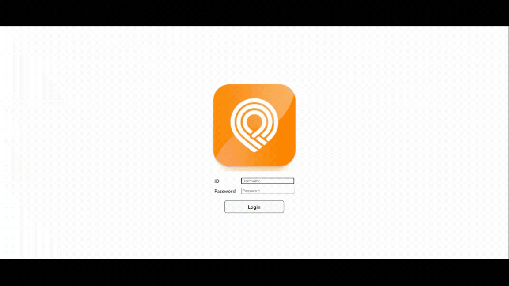

# SSAFY 9기 기업연계프로젝트 

# 🥥 COCO TAXI🚖

## **0️⃣ 프로젝트 개요**

🎈 프로젝트명 : COCO TAXI

📌 프로젝트 컨셉 : 코코넛사일로(주)에서 사용하는 앱인 KOKKOK Move의 ADMIN 페이지 제작

🛠 개발 기간 : 23.10.10 ~ 23.11.17 (5주)

💻 사용 기술스택 : SpringBoot, REACT 


## **1️⃣ 팀원 정보 및 업무 분담 내역**

| 이름         | 역할     | 설명                                                         |
| ------------ | -------- | ------------------------------------------------------------ |
| 김성우(팀장) | Frontend | React를 활용한 프론트 개발<br />JavaScript를 통한 API 호출 및 자료구조 알고리즘 적용을 통한 API들의 최적화된 송출 |
| 김남우       | Frontend | React와 JavaScript를 이용한 프론트 개발 컴포넌트 설계 ReverseGeocoding(OpenStreetMap/Nominatim) <br />requestAnimationFrame <br />UI/UX |
| 김민태       | Frontend | Open Router Service 를 활용한 경로 추출 및 Google Map 적용<br />SSE 통신을 통한 실시간 차량위치 마커 적용<br />ORS 좌표 변형 Google map Polyline 적용<br />DataBase 유지 및 보수 |
| 홍성민       | Backend  | ERD 설계<br />MariaDB 기반 데이터베이스 구축 및 데이터 관리 <br />Backend Spring Data JPA 적용 API 적용 <br />ORS API 활용, SSE 통신 구현 |


## **2️⃣ 서비스 대표 기능**

<h4>Google MAP</h4>

| 기능            | 세부기능                                                     |
| --------------- | ------------------------------------------------------------ |
| 구글맵          | 영어 버전 Google Map, 라오스어 적용, 교통정보, 위성 사진 제공 |
| 마크            | 호출 요청 및 운전자 시각화 마크 제공 및 정보 제공            |
| 리스트업        | 6km 이내의 법인차량 및 개인차량 리스트업                     |
|                 | 30초 이상 배차가 안된 고객 리스트업                          |
|                 | 승객과 차량의 최적의 경로 리스트업                           |
| 실시간 모니터링 | 법인 차량 및 개인 차량 위치와 정보 실시간 모니터링           |
| 강제 배차       | 승객과 차량의 Dispatch 버튼을 통한 강제 배차                 |


### **프로젝트의 특장점 **

1. 구글 경로 API 사용료를 줄이기 위해 Open Router Service 를 사용하여 비용을 절감
1. SSE를 통해 기사의 실시간 위치를 반영, 지도에 실시간으로 위치 변동
1. ReverseGeocoding 으로 위도/경도 좌표계 - 주소 상호변환 
1. RequestAnimationFrame으로 사용자 모니터 프레임 맞춤형 애니메이션 구현 


​					


## 3️⃣ 서비스 화면

<h4>로그인</h4>



<h4>실시간 모니터링</h4>


<h4>고객 리스트업</h4>


<h4>법인 차량 및 개인차량 리스트업</h4>


<h4>최적 경로 리스트업</h4>


<h4>강제 배차</h4>


## 4️⃣ 시스템 아키텍처 및 개발 환경

<h4>🌐 공통</h4>

| 상세       |       내용        |
| ---------- | :---------------: |
| GitLab     |     형상 관리     |
| Jira       | 일정 및 이슈 관리 |
| Mattermost |   커뮤니케이션    |
| Notion     | 일정 및 문서 관리 |

</br>

<h4>📱 FrontEnd&BackEnd</h4>

| 상세       |  버전   |
| :--------- | :-----: |
| REACT      |  1.82   |
| Node       | 18.18.2 |
| Redux      |  4.2.1  |
| Java       |   11    |
| SpringBoot | 2.7.17  |
| Maria DB   | 11.1.2  |
| Jenkins    | 2.414.3 |
| Pipeline   |  2.33   |
| Ubuntu     |  20.04  |
| Docker     | 24.0.6  |


<h4>System Architecture</h4>


## 5️⃣ 컴포넌트 구조 및 프로토타입

<h4>📱 FrontEnd</h4>

```
📂 Front_end
  ㄴ📂 src 
 	 ㄴ📂 assets
  		ㄴ📘 CoCo.png
  		ㄴ📘 react.svg
      ㄴ📂 components
         ㄴ📄 AdminLogin.jsx
         ㄴ📄 ClientList.jsx
         ㄴ📄 DispatchCheck.jsx
         ㄴ📄 DispatchDriverList.jsx
         ㄴ📄 ManualInformation.jsx
         ㄴ📄 MapComponent.jsx
         ㄴ📄 MatchingToast.jsx
         ㄴ📄 MovingCarMap.jsx	
      ㄴ📂 navigations
     	 ㄴ📝App.css
      	 ㄴ📄 App.jsx
      ㄴ📂 redux
         ㄴ📄 action.js
         ㄴ📄 redux.js
         ㄴ📄 store.js
  🐳 Dockerfile
  📝 index.html
  📝 package.json
  📝 vite.config.js
  
```

<h4>💾 BackEnd</h4>

```
📂 src/main/java
  ㄴ📦 com.s001.cocotaxi
      ㄴ📦 config
          ㄴ📄 EncodeConfig.java
          ㄴ📄 SwaggerConfig.java
          ㄴ📄 WebConfig.java
      ㄴ📦 controller
          ㄴ📄 CallingsController.java
          ㄴ📄 ClientController.java
          ㄴ📄 DispatchController.java
          ㄴ📄 DriverController.java
          ㄴ📄 UserController.java
      ㄴ📦 domain
          ㄴ📄 Callings.java
          ㄴ📄 Client.java
          ㄴ📄 Dispatch.java
          ㄴ📄 Driver.java
          ㄴ📄 DriverMoving.java
      ㄴ📦 dto
          ㄴ📦 request
              ㄴ📄 AddClientRequest.java
              ㄴ📄 DispatchRequest.java
          ㄴ📦 response
              ㄴ📄 AllDriverResponse.java
              ㄴ📄 CallAndDriverResponse.java
              ㄴ📄 CallingDetailResponse.java
              ㄴ📄 CallingsResponse.java
              ㄴ📄 ClientResponse.java
              ㄴ📄 DispatchListResponse.java
              ㄴ📄 DriverDetailResponse.java
      ㄴ📦 jwt
          ㄴ📦 config
              ㄴ📄 SecurityConfig.java
          ㄴ📦 controller
              ㄴ📄 JwtLoginApiController.java
          ㄴ📦 domain
              ㄴ📄 User.java
              ㄴ📄 UserRole.java
          ㄴ📦 dto
              ㄴ📄 JoinRequest.java
              ㄴ📄 LoginRequest.java
          ㄴ📦 filter    
              ㄴ📄 JwtTokenFilter.java
          ㄴ📦 repository    
              ㄴ📄 UserRepository.java
          ㄴ📦 service    
              ㄴ📄 UserService.java
          ㄴ📦 util    
              ㄴ📄 JwtTokenUtil.java
      ㄴ📦 openRouteService
          ㄴ📦 config
              ㄴ📄 AppConfig.java
          ㄴ📦 controller
              ㄴ📄 RouteController.java
          ㄴ📦 dto
              ㄴ📄 CoordinateResponse.java
              ㄴ📄 RouteAddressFeature.java
              ㄴ📄 RouteAddressProperties.java
              ㄴ📄 RouteAddressResponse.java
              ㄴ📄 RouteFeature.java
              ㄴ📄 RouteGeometry.java
              ㄴ📄 RouteProperties.java
              ㄴ📄 RouteResponse.java
              ㄴ📄 RouteSegment.java
              ㄴ📄 RouteStep.java
              ㄴ📄 RouteSummary.java
          ㄴ📦 service
              ㄴ📄 OpenRouteService.java
      ㄴ📦 repository
          ㄴ📄 CallRepository.java
          ㄴ📄 ClientRepository.java
          ㄴ📄 DispatchRepository.java
          ㄴ📄 DriverRepository.java
          ㄴ📄 MovingRepository.java
      ㄴ📦 service
          ㄴ📄 CallingsService.java
          ㄴ📄 CallingsServiceImpl.java
          ㄴ📄 ClientService.java
          ㄴ📄 DispatchService.java
          ㄴ📄 DispatchServiceImpl.java
          ㄴ📄 DriverService.java
          ㄴ📄 DriverServiceImpl.java
          ㄴ📄 MovingService.java
      ㄴ📦 openRouteService
          ㄴ📦 DTO
              ㄴ📄 Location.java
          ㄴ📦 sseemitter
              ㄴ📄 SseEmitters.java
          ㄴ📦 sserepository
              ㄴ📄 EmitterRepository.java
          ㄴ📦 sseservice
              ㄴ📄 SseService.java
    ㄴ📄 CocotaxiApplication.java
📂 src/main/resources
    ㄴ📂 static
        ㄴ📄 index.html
    ㄴ📄 application.yml
📄 .gitignore
🐘 build.gradle
🐳 Dockerfile
🐘 gradlew
🐘 gradlew.bat
🐘 settings.gradle
```


## 6️⃣ 데이터베이스 모델링 (ERD)


## 7️⃣ Convention

### Commit Convention

> **"[Type] #(Jira issue number) Commit message"**

- Type
  - **Fix** : 잘못된 동작을 고칠 때

    > fix function/error/typo in style.css

  - option
    - funtion : 고친 함수 명 (e.g. fix login function in index.html)
    - error : 수정한 에러 (e.g. fix [구체적 에러명] error in login.js)
    - typo : 오타 (e.g. fix typo in style.css)
  - **Add** : 새로운 것을 추가할 때

    > add mytest.test for test (새로운 파일 추가 시)

    > add blue color to style.css (기존 파일에 내용 추가 시)

  - **Move** : 코드나 파일을 이동할 때

    > move A to B (e.g. A를 B로 이동할 때)

  - **Rename** : 이름 변경이 있을 때

    > rename A to B (e.g. A를 B로 이름을 변경할 때)

  - **Update** : 정상적으로 동작하는 파일을 보완하는 경우

    > update test.js to use HTTPS (test.js에 기존의 프로토콜에서 HTTPS 프로토콜 사용으로 변경)

  - **Remove** : 삭제가 있을 때

    > remove test.js (파일 삭제 시)

    > remove black color from style.css (파일 내 부분 삭제 시)
- #(Jira issue number) : Click 시, Jira에서 해당 Issue에 대한 상세 내용 확인 가능
- Commit message : 변경 사항에 대해 명확하게 기술


## **8️⃣ 회고**

| 이름                                                         | 내용                                                         |
| ------------------------------------------------------------ | ------------------------------------------------------------ |
| <a href="https://github.com/ImChrisKim"> | **김성우** <br />프론트앤드는 여러 컴포넌트를 만들고 컴포넌트 간의 로직을 구현하는 것이 가장 큰 부분인 줄 알았지만, 핵심적인 부분은 내부 콜백 함수를 포함한 함수들의 연결과 여러 객체 관리를 통한 많은 데이터를 효율적으로 출력하는 것이라는 것을 알게 되었고, 객체 관리와 함수 관리 및 내부 로직들의 연결에 대해 깊이 경험하고 배울 수 있게 되었습니다. |
| <a href="https://github.com/niyamallo"> | **김남우** <br />개발한 대부분의 컴포넌트를 한 페이지에 위치시키는 과정에서 컴포넌트의 구조를 설계하는 것이 어려웠다. 특정 데이터를 어떤 컴포넌트가 가지고 있어야하는지 고민하며 구조를 만들었지만, 기능이나 컴포넌트가 추가될 때마다 데이터의 전달 루트를 새롭게 구성해야했고, 만족스러운 최적화가 되지 않은 상태이다.(추후 리팩토링을 통해 해당 부분 수정 예정). 다량의 위치 데이터가 포함된 테이블에 ReverseGeocoding을 구현하고 적용하며 최소한의 API를 호출하는 로직을 구성하기 어려웠다. requestAnimationFrame을 사용하며 Animation Frame이라는 별도의 queue에 콜백 함수를 담아 실행이 밀리는 현상을 감소시키는 작동원리를 학습했다. 추가적으로 CPU나 GPU 사용량 여부에 따른 콜백 함수의 실행 순서에 대해서도 학습하였다. 기업에서 실제 사용하는 서비스의 일부분을 구현하며 직간접적으로 임직원의 피드백을 받을 수 있었다는 점이 좋았다. 현업에서 요구하는 페이지의 퀄리티를 만들어내기 위해서는 개발에 앞서 컴포넌트의 구조를 정확하게 설계해야 한다는 점을 절실히 느꼈다. 리팩토링을 통해 데이터 전달 과정을 최적화하며 해당 부분에 대해 깊게 고민해볼 계획이다. |
| <a href="https://github.com/minsoon025"> | **김민태**<br /> 기업과 프로젝트를 진행하면서 요구를 인지하고 맞춰가는 일은 지금까지 해왔던 프로젝트랑 다르게 정리해서 피드백 받고 추가적으로 디벨롭 하는 일은 새롭게 다가왔습니다. <br />기업에서 요금을 절감하기 위해 ORS를 활용해 구글 맵에 적용을 하였는데, 실질적으로 이러한 일이 사업적인 측면에서 더 좋다는 새로운 관점도 배워간 좋은 경험이였습니다. |
| <a href="https://github.com/HHongmoris"> | **홍성민**<br />  기업과 연계하여 진행한 프로젝트였기에 기업과 소통하는 방식, 요구사항에 맞춰 프로젝트를 확장시키는 방법들을 배울 수 있었습니다. 다른 지역에 있는 팀원과 함께하다보니 온라인과 오프라인을 오가며 소통하고 프로젝트를 진행하여 새로웠고, 온오프라인의 팀 프로젝트를 경험할 수 있어서 좋았습니다. SSE를 통한 실시간 데이터 전송을 구현하여 프로젝트의 완성도를 높일 수 있어 뿌듯했고, 다음에는 웹소켓 서버를 통한 양방향 통신 방식을 구현해보고 싶었습니다. |
